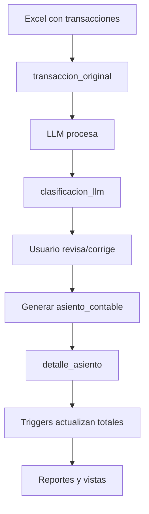

Paso 1:
instalar requirements.txt

Paso 2:
## Documentación de Base de Datos

---

## 📋 Índice
- [🎯 Descripción General](#-descripción-general)
- [🗃️ Tablas del Sistema](#️-tablas-del-sistema)
- [🔢 Secuencias](#-secuencias)
- [👁️ Vistas](#️-vistas)
- [⚡ Funciones](#-funciones)
- [🔄 Triggers (Disparadores)](#-triggers-disparadores)
- [📊 Flujo de Datos](#-flujo-de-datos)
- [💡 Casos de Uso](#-casos-de-uso)

---

## 🎯 Descripción General

Esta base de datos está diseñada para un sistema contable que permite:
- ✅ Cargar transacciones desde archivos Excel
- 🤖 Clasificar automáticamente usando LLMs (GPT, Claude, etc.)
- ✏️ Editar y corregir clasificaciones
- 📈 Generar reportes contables
- ⚖️ Verificar balances automáticamente

---

## 🗃️ Tablas

### 📊 1. `tipo_cuenta`
**Propósito**: Define los tipos básicos de cuentas contables según principios contables.

| Campo | Tipo | Descripción |
|-------|------|-------------|
| `id` | SERIAL | ID único automático |
| `nombre_tipo` | VARCHAR(50) | Nombre del tipo (ACTIVO, PASIVO, etc.) |
| `descripcion` | TEXT | Descripción detallada |
| `naturaleza` | VARCHAR(10) | DEUDORA o ACREEDORA |
| `created_at` | TIMESTAMP | Fecha de creación |

**Datos iniciales**:
- ACTIVO (DEUDORA) - Recursos de la empresa
- PASIVO (ACREEDORA) - Obligaciones de la empresa
- PATRIMONIO (ACREEDORA) - Capital y utilidades
- INGRESO (ACREEDORA) - Ingresos por ventas/servicios
- EGRESO (DEUDORA) - Gastos operativos

---

### 🏦 2. `cuenta`
**Propósito**: Catálogo completo de cuentas contables con estructura jerárquica.

| Campo | Tipo | Descripción |
|-------|------|-------------|
| `id` | SERIAL | ID único automático |
| `codigo_cuenta` | VARCHAR(20) | Código contable (ej: 1101) |
| `nombre_cuenta` | VARCHAR(200) | Nombre de la cuenta |
| `descripcion` | TEXT | Descripción detallada |
| `tipo_cuenta_id` | INTEGER | FK a `tipo_cuenta` |
| `nivel` | INTEGER | 1=Mayor, 2=Submayor, 3=Auxiliar |
| `parent_id` | INTEGER | FK a cuenta padre (jerarquía) |
| `activa` | BOOLEAN | Si la cuenta está activa |
| `created_at` | TIMESTAMP | Fecha de creación |
| `updated_at` | TIMESTAMP | Última actualización |

**Estructura jerárquica**:
```
1 - ACTIVO (Nivel 1 - Mayor)
  └── 11 - ACTIVO CORRIENTE (Nivel 2 - Submayor)
      ├── 1101 - Caja (Nivel 3 - Auxiliar)
      ├── 1102 - Bancos (Nivel 3 - Auxiliar)
      └── 1103 - Cuentas por Cobrar (Nivel 3 - Auxiliar)
```

---

### 🏷️ 3. `categoria`
**Propósito**: Categorías para ayudar al LLM a clasificar transacciones automáticamente.

| Campo | Tipo | Descripción |
|-------|------|-------------|
| `id` | SERIAL | ID único automático |
| `nombre` | VARCHAR(100) | Nombre de la categoría |
| `descripcion` | TEXT | Descripción detallada |
| `tipo` | VARCHAR(20) | INGRESO o EGRESO |
| `cuenta_sugerida_id` | INTEGER | FK a `cuenta` (sugerencia del sistema) |
| `activa` | BOOLEAN | Si la categoría está activa |
| `created_at` | TIMESTAMP | Fecha de creación |

**Ejemplos**:
- Ventas de Productos → Cuenta 4101
- Gastos de Oficina → Cuenta 5102
- Alquileres → Cuenta 5102

---

### 📄 4. `transaccion_original`
**Propósito**: Almacena las transacciones tal como vienen del archivo Excel, sin procesar.

| Campo | Tipo | Descripción |
|-------|------|-------------|
| `id` | SERIAL | ID único automático |
| `fecha` | DATE | Fecha de la transacción |
| `descripcion` | TEXT | Descripción original del Excel |
| `monto` | DECIMAL(15,2) | Cantidad en dinero |
| `moneda` | VARCHAR(5) | USD, EUR, etc. |
| `archivo_origen` | VARCHAR(255) | Nombre del archivo Excel |
| `fila_origen` | INTEGER | Número de fila en el Excel |
| `procesada` | BOOLEAN | Si ya fue procesada por el LLM |
| `created_at` | TIMESTAMP | Cuando se cargó |

**Ejemplo**:
```
fecha: 2025-08-01
descripcion: "Venta de 5 camisetas"
monto: 50.00
moneda: USD
archivo_origen: "ventas_agosto.xlsx"
fila_origen: 2
```

---

### 🤖 5. `clasificacion_llm`
**Propósito**: Guarda las clasificaciones automáticas realizadas por el LLM (GPT, Claude, etc.).

| Campo | Tipo | Descripción |
|-------|------|-------------|
| `id` | SERIAL | ID único automático |
| `transaccion_original_id` | INTEGER | FK a `transaccion_original` |
| `tipo_transaccion` | VARCHAR(20) | INGRESO o EGRESO |
| `categoria_id` | INTEGER | FK a `categoria` |
| `cuenta_sugerida_id` | INTEGER | FK a `cuenta` sugerida |
| `confianza` | DECIMAL(3,2) | Nivel de confianza (0.00-1.00) |
| `justificacion` | TEXT | Explicación del LLM |
| `modelo_usado` | VARCHAR(50) | gpt-4o-mini, claude-haiku, etc. |
| `revisada` | BOOLEAN | Si fue revisada por humano |
| `created_at` | TIMESTAMP | Cuando se clasificó |

**Ejemplo**:
```
transaccion: "Venta de 5 camisetas"
tipo_transaccion: "INGRESO"
categoria: "Ventas de Productos"
cuenta_sugerida: 4101 - Ventas
confianza: 0.95
justificacion: "Es claramente una venta de productos"
modelo_usado: "gpt-4o-mini"
```

---

### 📚 6. `asiento_contable`
**Propósito**: Los asientos contables formales (partida doble) que se generan del sistema.

| Campo | Tipo | Descripción |
|-------|------|-------------|
| `id` | SERIAL | ID único automático |
| `numero_asiento` | VARCHAR(20) | Número único (ASI-2025-001) |
| `fecha` | DATE | Fecha del asiento |
| `descripcion` | TEXT | Descripción del asiento |
| `referencia` | VARCHAR(100) | Referencia externa |
| `transaccion_original_id` | INTEGER | FK a `transaccion_original` |
| `total_debe` | DECIMAL(15,2) | Suma total del DEBE |
| `total_haber` | DECIMAL(15,2) | Suma total del HABER |
| `balanceado` | BOOLEAN | Si DEBE = HABER |
| `estado` | VARCHAR(20) | BORRADOR, CONFIRMADO, ANULADO |
| `created_by` | VARCHAR(100) | Usuario que lo creó |
| `created_at` | TIMESTAMP | Fecha de creación |
| `updated_at` | TIMESTAMP | Última actualización |

---

### 📋 7. `detalle_asiento`
**Propósito**: Los movimientos individuales de cada asiento contable (debe y haber).

| Campo | Tipo | Descripción |
|-------|------|-------------|
| `id` | SERIAL | ID único automático |
| `asiento_contable_id` | INTEGER | FK a `asiento_contable` |
| `cuenta_id` | INTEGER | FK a `cuenta` |
| `descripcion` | TEXT | Descripción del movimiento |
| `debe` | DECIMAL(15,2) | Cantidad en el DEBE |
| `haber` | DECIMAL(15,2) | Cantidad en el HABER |
| `orden` | INTEGER | Orden dentro del asiento |
| `created_at` | TIMESTAMP | Fecha de creación |

**Restricción importante**: Solo puede tener valor en DEBE o HABER, no ambos.

**Ejemplo de asiento balanceado**:
```
Asiento: ASI-2025-001 "Venta de productos"
├── Detalle 1: Caja (1101) - DEBE: $50.00
└── Detalle 2: Ventas (4101) - HABER: $50.00
Total DEBE: $50.00 = Total HABER: $50.00 ✅
```

---

### 📅 8. `periodo_contable`
**Propósito**: Define períodos contables para filtrar reportes y análisis.

| Campo | Tipo | Descripción |
|-------|------|-------------|
| `id` | SERIAL | ID único automático |
| `nombre` | VARCHAR(50) | "Enero 2025", "Q1 2025", "2025" |
| `tipo_periodo` | VARCHAR(20) | MENSUAL, TRIMESTRAL, ANUAL |
| `fecha_inicio` | DATE | Inicio del período |
| `fecha_fin` | DATE | Fin del período |
| `año` | INTEGER | Año del período |
| `mes` | INTEGER | Mes (solo para MENSUAL) |
| `trimestre` | INTEGER | Trimestre (solo para TRIMESTRAL) |
| `activo` | BOOLEAN | Si está activo |
| `cerrado` | BOOLEAN | Si está cerrado contablemente |
| `created_at` | TIMESTAMP | Fecha de creación |

---

### 🔍 9. `auditoria`
**Propósito**: Registra TODOS los cambios realizados en el sistema para trazabilidad completa.

| Campo | Tipo | Descripción |
|-------|------|-------------|
| `id` | SERIAL | ID único automático |
| `tabla` | VARCHAR(50) | Nombre de la tabla modificada |
| `registro_id` | INTEGER | ID del registro modificado |
| `accion` | VARCHAR(20) | INSERT, UPDATE, DELETE |
| `valores_anteriores` | JSONB | Valores antes del cambio |
| `valores_nuevos` | JSONB | Valores después del cambio |
| `usuario` | VARCHAR(100) | Usuario que hizo el cambio |
| `timestamp` | TIMESTAMP | Cuándo ocurrió |

---

### ⚙️ 10. `configuracion`
**Propósito**: Configuraciones globales del sistema.

| Campo | Tipo | Descripción |
|-------|------|-------------|
| `id` | SERIAL | ID único automático |
| `clave` | VARCHAR(100) | Nombre de la configuración |
| `valor` | TEXT | Valor de la configuración |
| `descripcion` | TEXT | Descripción |
| `tipo_dato` | VARCHAR(20) | STRING, NUMBER, BOOLEAN, JSON |
| `updated_at` | TIMESTAMP | Última actualización |

**Configuraciones incluidas**:
```
moneda_base: "USD"
empresa_nombre: "Mi Empresa S.A. de C.V."
llm_modelo: "gpt-4o-mini"
llm_confianza_minima: "0.7"
```

---

## 🔢 Secuencias

Las **secuencias** son contadores automáticos que PostgreSQL crea para campos `SERIAL`:

| Secuencia | Tabla | Propósito |
|-----------|-------|-----------|
| `tipo_cuenta_id_seq` | tipo_cuenta | Genera IDs únicos para tipos de cuenta |
| `cuenta_id_seq` | cuenta | Genera IDs únicos para cuentas |
| `categoria_id_seq` | categoria | Genera IDs únicos para categorías |
| `transaccion_original_id_seq` | transaccion_original | Genera IDs únicos para transacciones |
| `clasificacion_llm_id_seq` | clasificacion_llm | Genera IDs únicos para clasificaciones |
| `asiento_contable_id_seq` | asiento_contable | Genera IDs únicos para asientos |
| `detalle_asiento_id_seq` | detalle_asiento | Genera IDs únicos para detalles |
| `periodo_contable_id_seq` | periodo_contable | Genera IDs únicos para períodos |
| `auditoria_id_seq` | auditoria | Genera IDs únicos para auditoría |
| `configuracion_id_seq` | configuracion | Genera IDs únicos para configuraciones |

**¿Qué hacen?**
- Se incrementan automáticamente cada vez que insertas un registro
- Garantizan que los IDs sean únicos y consecutivos

---

## 👁️ Vistas

Las **vistas** son "tablas virtuales" que muestran datos de varias tablas combinadas:

### 📖 `vista_libro_diario`
**Propósito**: Muestra todos los asientos contables en formato de libro diario tradicional.

**Campos mostrados**:
- `numero_asiento` - Número del asiento
- `fecha` - Fecha del asiento
- `descripcion` - Descripción del asiento
- `codigo_cuenta` - Código de la cuenta
- `nombre_cuenta` - Nombre de la cuenta
- `detalle_descripcion` - Descripción específica del movimiento
- `debe` - Monto en el debe
- `haber` - Monto en el haber
- `estado` - Estado del asiento

**Ejemplo de consulta**:
```sql
SELECT * FROM vista_libro_diario 
WHERE fecha BETWEEN '2025-08-01' AND '2025-08-31';
```

### 📈 `vista_libro_mayor`
**Propósito**: Muestra el libro mayor con saldos acumulados por cuenta.

**Campos mostrados**:
- `codigo_cuenta` - Código de la cuenta
- `nombre_cuenta` - Nombre de la cuenta
- `naturaleza` - DEUDORA o ACREEDORA
- `fecha` - Fecha del movimiento
- `numero_asiento` - Número del asiento
- `descripcion` - Descripción del movimiento
- `debe` - Monto en el debe
- `haber` - Monto en el haber
- `saldo` - Saldo acumulado (calculado automáticamente)

**¿Por qué son útiles las vistas?**
- ✅ Simplifican consultas complejas
- ✅ Se actualizan automáticamente
- ✅ Perfectas para reportes
- ✅ No ocupan espacio adicional

---

## ⚡ Funciones

Las **funciones** son código reutilizable que se ejecuta en la base de datos:

### 🕐 `actualizar_updated_at()`
**Propósito**: Actualiza automáticamente el campo `updated_at` cuando se modifica un registro.

**¿Qué hace?**
```sql
-- Cada vez que actualizas un registro:
UPDATE cuenta SET nombre_cuenta = 'Nuevo nombre' WHERE id = 1;
-- La función automáticamente pone updated_at = NOW()
```

### 🧮 `actualizar_totales_asiento()`
**Propósito**: Recalcula automáticamente los totales de debe y haber en un asiento contable.

**¿Qué hace?**
1. Suma todos los valores DEBE del asiento
2. Suma todos los valores HABER del asiento
3. Actualiza `total_debe` y `total_haber`
4. Marca `balanceado = true` si DEBE = HABER

**Ejemplo**:
```sql
-- Cuando agregas un detalle:
INSERT INTO detalle_asiento (asiento_contable_id, cuenta_id, debe) 
VALUES (1, 5, 100.00);

-- La función automáticamente actualiza:
-- total_debe = suma de todos los debe del asiento
-- total_haber = suma de todos los haber del asiento
-- balanceado = (total_debe = total_haber)
```

---

## 🔄 Triggers (Disparadores)

Los **triggers** son "eventos automáticos" que se ejecutan cuando ocurre algo en la base de datos:

### 📅 Triggers de Actualización de Timestamp
**Se ejecutan**: ANTES de actualizar registros en ciertas tablas

| Trigger | Tabla | Cuándo se ejecuta |
|---------|-------|------------------|
| `trg_cuenta_updated_at` | cuenta | Antes de UPDATE |
| `trg_asiento_updated_at` | asiento_contable | Antes de UPDATE |
| `trg_configuracion_updated_at` | configuracion | Antes de UPDATE |

**¿Qué hacen?**
- Automáticamente ponen `updated_at = NOW()` 
- Te olvidas de actualizar fechas manualmente

### 🧮 Triggers de Totales de Asiento
**Se ejecutan**: DESPUÉS de cambios en `detalle_asiento`

| Trigger | Cuándo se ejecuta |
|---------|------------------|
| `trg_detalle_totales_insert` | Después de INSERT |
| `trg_detalle_totales_update` | Después de UPDATE |
| `trg_detalle_totales_delete` | Después de DELETE |

**¿Qué hacen?**
- Recalculan automáticamente los totales del asiento padre
- Mantienen siempre actualizado el balance
- Garantizan integridad contable

**Ejemplo práctico**:
```sql
-- 1. Tienes un asiento con total_debe = $100, total_haber = $100
-- 2. Agregas un nuevo detalle:
INSERT INTO detalle_asiento (asiento_contable_id, cuenta_id, debe) 
VALUES (1, 3, 50.00);

-- 3. El trigger automáticamente actualiza:
--    total_debe = $150
--    total_haber = $100  
--    balanceado = false (porque no están iguales)
```

---

## 📊 Flujo de Datos

### 🔄 Proceso Completo del Sistema



### 📝 Flujo Detallado

1. **Carga inicial** 📤
   - Usuario sube Excel → `transaccion_original`
   - Datos quedan sin procesar (`procesada = false`)

2. **Clasificación automática** 🤖
   - LLM analiza cada transacción
   - Genera clasificación → `clasificacion_llm`
   - Sugiere tipo, categoría y cuenta contable

3. **Revisión humana** 👤
   - Usuario revisa clasificaciones del LLM
   - Corrige errores si es necesario
   - Marca como revisada (`revisada = true`)

4. **Generación de asientos** ⚖️
   - Sistema crea asientos contables formales
   - Un asiento → `asiento_contable`
   - Detalles → `detalle_asiento`
   - Triggers calculan totales automáticamente

5. **Reportes** 📊
   - Vistas generan libro diario y mayor
   - Sistema verifica balances
   - Exporta a Excel/HTML

---

## 💡 Casos de Uso

### 📊 Consultas Útiles

**Ver todas las transacciones pendientes de clasificar**:
```sql
SELECT * FROM transaccion_original WHERE procesada = false;
```

**Ver clasificaciones con baja confianza**:
```sql
SELECT * FROM clasificacion_llm WHERE confianza < 0.8;
```

**Ver asientos desbalanceados**:
```sql
SELECT * FROM asiento_contable WHERE balanceado = false;
```

**Reporte mensual de ingresos**:
```sql
SELECT 
    c.nombre_cuenta,
    SUM(d.haber) as total_ingresos
FROM detalle_asiento d
JOIN cuenta c ON d.cuenta_id = c.id
JOIN tipo_cuenta tc ON c.tipo_cuenta_id = tc.id
JOIN asiento_contable a ON d.asiento_contable_id = a.id
WHERE tc.nombre_tipo = 'INGRESO'
    AND a.fecha BETWEEN '2025-08-01' AND '2025-08-31'
    AND a.estado = 'CONFIRMADO'
GROUP BY c.nombre_cuenta
ORDER BY total_ingresos DESC;
```

### 🔧 Mantenimiento

**Limpiar clasificaciones antiguas**:
```sql
DELETE FROM clasificacion_llm 
WHERE created_at < NOW() - INTERVAL '6 months'
    AND revisada = false;
```

**Verificar integridad de balances**:
```sql
SELECT 
    numero_asiento,
    total_debe,
    total_haber,
    (total_debe - total_haber) as diferencia
FROM asiento_contable 
WHERE balanceado = false;
```


