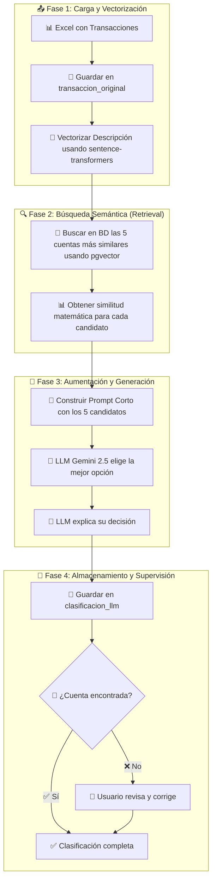

## 🚀 Instalación


**Preparar PostgreSQL con pgvector**

**Docker**
```yaml
# docker-compose.yml
services:
  db16:
    image: pgvector/pgvector:pg16
    environment:
      POSTGRES_PASSWORD: 12345678
    ports:
      - "5432:5432"
    volumes:
      - ./data:/var/lib/postgresql/data
      - ./init:/docker-entrypoint-initdb.d


  pgadmin4_16:
    image: dpage/pgadmin4
    container_name: ProyectoContable_db16
    environment:
      PGADMIN_DEFAULT_EMAIL: usuario@ues.edu.sv
      PGADMIN_DEFAULT_PASSWORD: 12345678
      PGADMIN_LISTEN_PORT: 5050
    ports:
      - "5050:5050"
    depends_on:
      - db16

```

## 📋 Índice
- [🎯 Descripción General](#-descripción-general)
- [⚙️ Preparación del Entorno](#️-preparación-del-entorno)
- [🗃️ Tablas del Sistema](#️-tablas-del-sistema)
- [🔢 Secuencias](#-secuencias)
- [👁️ Vistas](#️-vistas)
- [⚡ Funciones](#-funciones)
- [🔄 Triggers (Disparadores)](#-triggers-disparadores)
- [📊 Flujo de Datos con RAG](#-flujo-de-datos-con-rag)
- [🚀 Instalación](#-instalación)
- [💡 Casos de Uso](#-casos-de-uso)

---

## 🎯 Descripción General

Este sistema contable está diseñado para automatizar la clasificación de transacciones financieras utilizando una arquitectura de **Inteligencia Artificial de última generación**. Permite:

- ✅ **Cargar transacciones masivamente** desde archivos Excel
- 🧠 **Clasificar cuentas con alta precisión** usando un modelo de **Búsqueda Aumentada por Generación (RAG)**, que combina búsqueda semántica vectorial con un LLM (Gemini 2.5)
- ✏️ **Supervisión y corrección humana** de las clasificaciones automáticas
- 📈 **Generar reportes contables** para análisis
- ⚖️ **Verificar balances automáticamente**

### 🎭 **¿Qué es RAG?**

**RAG = Retrieval-Augmented Generation (Búsqueda Aumentada por Generación)**

En lugar de que el LLM "adivine" la cuenta correcta entre cientos de opciones:

1. 🔍 **Retrieval**: Busca semánticamente las 5 cuentas más similares
2. 🧠 **Augmentation**: Le da al LLM solo esas 5 opciones
3. ⚡ **Generation**: El LLM elige la mejor de las 5

**Resultado**: Mayor precisión, menor costo, respuestas más rápidas.

---

## ⚙️ Preparación del Entorno

### 1. 📦 Instalar Dependencias
```bash
pip install -r requirements.txt
```

### 2. 🐳 Configurar la Base de Datos (Primera Vez)
El sistema requiere la extensión **pgvector** en PostgreSQL.

```sql
-- Ejecutar en pgAdmin una sola vez
CREATE EXTENSION IF NOT EXISTS vector;
```

### 3. 📚 Cargar Datos Maestros (Primera Vez)
Para que el sistema funcione, necesita el catálogo de cuentas y su mapa semántico:

```bash
# 1. Cargar el catálogo de cuentas desde tu archivo Excel
python manage.py importar_cuentas ruta/a/tu/catalogo.xlsx

# 2. Generar los embeddings (mapa semántico) para las cuentas cargadas
python manage.py generar_embeddings
```

---

## 🗃️ Tablas del Sistema

### 📊 1. `tipo_cuenta`
**Propósito**: Define los tipos básicos de cuentas contables según principios contables.

| Campo | Tipo | Descripción |
|-------|------|-------------|
| `id` | SERIAL | ID único automático |
| `nombre_tipo` | VARCHAR(50) | Nombre del tipo (ACTIVO, PASIVO, etc.) |
| `descripcion` | TEXT | Descripción detallada |
| `naturaleza` | VARCHAR(10) | DEUDORA o ACREEDORA |
| `created_at` | TIMESTAMP | Fecha de creación |

**Datos iniciales**:
- ACTIVO (DEUDORA) - Recursos de la empresa
- PASIVO (ACREEDORA) - Obligaciones de la empresa
- PATRIMONIO (ACREEDORA) - Capital y utilidades
- INGRESO (ACREEDORA) - Ingresos por ventas/servicios
- EGRESO (DEUDORA) - Gastos operativos

---

### 🏦 2. `cuenta` ⭐ **CON EMBEDDINGS**
**Propósito**: Catálogo completo de cuentas contables, **enriquecido con representación semántica** para búsquedas inteligentes.

| Campo | Tipo | Descripción |
|-------|------|-------------|
| `id` | SERIAL | ID único automático |
| `codigo_cuenta` | VARCHAR(20) | Código contable (ej: 1101) |
| `nombre_cuenta` | VARCHAR(200) | Nombre de la cuenta |
| `descripcion` | TEXT | Descripción detallada |
| `tipo_cuenta_id` | INTEGER | FK a `tipo_cuenta` |
| `nivel` | INTEGER | 1=Mayor, 2=Submayor, 3=Auxiliar |
| `parent_id` | INTEGER | FK a cuenta padre (jerarquía) |
| `activa` | BOOLEAN | Si la cuenta está activa |
| `embedding` | **VECTOR(384)** | 🧠 **Vector semántico que representa el significado de la cuenta** |
| `created_at` | TIMESTAMP | Fecha de creación |
| `updated_at` | TIMESTAMP | Última actualización |

**Campo `embedding`**
- **Tipo**: `VECTOR(384)` - Vector matemático de 384 dimensiones
- **Propósito**: Representa el "significado" de la cuenta en forma matemática
- **Generación**: Se crea automáticamente con `python manage.py generar_embeddings`
- **Uso**: Permite búsquedas semánticas súper rápidas con pgvector

**Ejemplo conceptual**:
```
Cuenta: "5102 - Gastos de Publicidad"
Embedding: [0.1234, -0.5678, 0.9012, ...] (384 números)

Transacción: "Pago a Facebook Ads"  
Embedding: [0.1189, -0.5234, 0.8876, ...] (384 números)

Similitud matemática: 97.3% ✅ ¡Coincidencia perfecta!
```

---

### 🏷️ 3. `categoria`
**Propósito**: **Agrupar transacciones para análisis de negocio** y reportes gerenciales. Funciona como una capa de abstracción sobre el catálogo de cuentas técnico.

| Campo | Tipo | Descripción |
|-------|------|-------------|
| `id` | SERIAL | ID único automático |
| `nombre` | VARCHAR(100) | Nombre de la categoría (ej: "Gastos de Venta y Marketing") |
| `descripcion` | TEXT | Descripción detallada |
| `tipo` | VARCHAR(20) | INGRESO o EGRESO |
| `cuenta_sugerida_id` | INTEGER | FK a `cuenta` (sugerencia por defecto) |
| `activa` | BOOLEAN | Si la categoría está activa |
| `created_at` | TIMESTAMP | Fecha de creación |

- Ahora enfocada en **análisis gerencial** 
- Permite agrupar múltiples cuentas técnicas en categorías de negocio
- Ejemplo: Categoría "Marketing" puede incluir cuentas de publicidad, eventos, material promocional, etc.

---

### 📄 4. `transaccion_original`
**Propósito**: Almacena las transacciones tal como vienen del archivo Excel, sin procesar.

| Campo | Tipo | Descripción |
|-------|------|-------------|
| `id` | SERIAL | ID único automático |
| `fecha` | DATE | Fecha de la transacción |
| `descripcion` | TEXT | Descripción original del Excel |
| `monto` | DECIMAL(15,2) | Cantidad en dinero |
| `moneda` | VARCHAR(5) | USD, EUR, etc. |
| `archivo_origen` | VARCHAR(255) | Nombre del archivo Excel |
| `fila_origen` | INTEGER | Número de fila en el Excel |
| `procesada` | BOOLEAN | Si ya fue procesada por el LLM |
| `created_at` | TIMESTAMP | Cuando se cargó |

**Ejemplo**:
```
fecha: 2025-08-01
descripcion: "Venta de 5 camisetas"
monto: 50.00
moneda: USD
archivo_origen: "ventas_agosto.xlsx"
fila_origen: 2
```

---

### 🤖 5. `clasificacion_llm`
**Propósito**: Almacena las clasificaciones automáticas generadas por el **flujo RAG** (Retrieval-Augmented Generation).

| Campo | Tipo | Descripción |
|-------|------|-------------|
| `id` | SERIAL | ID único automático |
| `transaccion_original_id` | INTEGER | FK a `transaccion_original` |
| `tipo_transaccion` | VARCHAR(20) | INGRESO o EGRESO |
| `categoria_id` | INTEGER | FK a `categoria` **(para análisis gerencial)** |
| `cuenta_sugerida_id` | INTEGER | FK a `cuenta` **(para registro contable)** |
| `confianza` | DECIMAL(3,2) | Nivel de confianza del LLM (0.00-1.00) |
| `justificacion` | TEXT | **Explicación del LLM sobre su elección** |
| `revisada` | BOOLEAN | Si fue **validada por un humano** |
| `created_at` | TIMESTAMP | Cuándo se clasificó |


**Ejemplo del proceso**:
```
1. Transacción: "Pago de factura de internet de Tigo"

2. Búsqueda vectorial encuentra 5 candidatos:
   - 5201 - Servicios de Telecomunicaciones (similitud: 94.7%)
   - 5102 - Gastos de Oficina (similitud: 87.2%)
   - 5203 - Servicios Públicos (similitud: 82.1%)
   - 5105 - Gastos de Comunicación (similitud: 79.8%)
   - 5301 - Gastos Operativos (similitud: 72.3%)

3. LLM recibe solo estos 5 candidatos + la transacción

4. LLM responde: "5201 - Servicios de Telecomunicaciones"
   Justificación: "Es un gasto de internet de Tigo, claramente telecomunicaciones"
   Confianza: 0.96

5. Se guarda en clasificacion_llm ✅
```

- **Mayor precisión**: El LLM elige entre 5 opciones muy relevantes, no entre cientos
- **Menor costo**: Prompts más cortos = menos tokens = menos dinero
- **Mejor justificación**: El LLM puede explicar mejor su elección
- **Separación clara**: `categoria_id` para análisis, `cuenta_sugerida_id` para contabilidad

---

### 📚 6. `asiento_contable`
**Propósito**: Los asientos contables formales (partida doble) que se generan del sistema.

| Campo | Tipo | Descripción |
|-------|------|-------------|
| `id` | SERIAL | ID único automático |
| `numero_asiento` | VARCHAR(20) | Número único (ASI-2025-001) |
| `fecha` | DATE | Fecha del asiento |
| `descripcion` | TEXT | Descripción del asiento |
| `referencia` | VARCHAR(100) | Referencia externa |
| `transaccion_original_id` | INTEGER | FK a `transaccion_original` |
| `total_debe` | DECIMAL(15,2) | Suma total del DEBE |
| `total_haber` | DECIMAL(15,2) | Suma total del HABER |
| `balanceado` | BOOLEAN | Si DEBE = HABER |
| `estado` | VARCHAR(20) | BORRADOR, CONFIRMADO, ANULADO |
| `created_by` | VARCHAR(100) | Usuario que lo creó |
| `created_at` | TIMESTAMP | Fecha de creación |
| `updated_at` | TIMESTAMP | Última actualización |

---

### 📋 7. `detalle_asiento`
**Propósito**: Los movimientos individuales de cada asiento contable (debe y haber).

| Campo | Tipo | Descripción |
|-------|------|-------------|
| `id` | SERIAL | ID único automático |
| `asiento_contable_id` | INTEGER | FK a `asiento_contable` |
| `cuenta_id` | INTEGER | FK a `cuenta` |
| `descripcion` | TEXT | Descripción del movimiento |
| `debe` | DECIMAL(15,2) | Cantidad en el DEBE |
| `haber` | DECIMAL(15,2) | Cantidad en el HABER |
| `orden` | INTEGER | Orden dentro del asiento |
| `created_at` | TIMESTAMP | Fecha de creación |

**Restricción importante**: Solo puede tener valor en DEBE o HABER, no ambos.

**Ejemplo de asiento balanceado**:
```
Asiento: ASI-2025-001 "Venta de productos"
├── Detalle 1: Caja (1101) - DEBE: $50.00
└── Detalle 2: Ventas (4101) - HABER: $50.00
Total DEBE: $50.00 = Total HABER: $50.00 ✅
```

---

### 📅 8. `periodo_contable`
**Propósito**: Define períodos contables para filtrar reportes y análisis.

| Campo | Tipo | Descripción |
|-------|------|-------------|
| `id` | SERIAL | ID único automático |
| `nombre` | VARCHAR(50) | "Enero 2025", "Q1 2025", "2025" |
| `tipo_periodo` | VARCHAR(20) | MENSUAL, TRIMESTRAL, ANUAL |
| `fecha_inicio` | DATE | Inicio del período |
| `fecha_fin` | DATE | Fin del período |
| `año` | INTEGER | Año del período |
| `mes` | INTEGER | Mes (solo para MENSUAL) |
| `trimestre` | INTEGER | Trimestre (solo para TRIMESTRAL) |
| `activo` | BOOLEAN | Si está activo |
| `cerrado` | BOOLEAN | Si está cerrado contablemente |
| `created_at` | TIMESTAMP | Fecha de creación |

---

### 🔍 9. `auditoria`
**Propósito**: Registra TODOS los cambios realizados en el sistema para trazabilidad completa.

| Campo | Tipo | Descripción |
|-------|------|-------------|
| `id` | SERIAL | ID único automático |
| `tabla` | VARCHAR(50) | Nombre de la tabla modificada |
| `registro_id` | INTEGER | ID del registro modificado |
| `accion` | VARCHAR(20) | INSERT, UPDATE, DELETE |
| `valores_anteriores` | JSONB | Valores antes del cambio |
| `valores_nuevos` | JSONB | Valores después del cambio |
| `usuario` | VARCHAR(100) | Usuario que hizo el cambio |
| `timestamp` | TIMESTAMP | Cuándo ocurrió |

---

### ⚙️ 10. `configuracion`
**Propósito**: Configuraciones globales del sistema.

| Campo | Tipo | Descripción |
|-------|------|-------------|
| `id` | SERIAL | ID único automático |
| `clave` | VARCHAR(100) | Nombre de la configuración |
| `valor` | TEXT | Valor de la configuración |
| `descripcion` | TEXT | Descripción |
| `tipo_dato` | VARCHAR(20) | STRING, NUMBER, BOOLEAN, JSON |
| `updated_at` | TIMESTAMP | Última actualización |

**Configuraciones incluidas**:
```
moneda_base: "USD"
empresa_nombre: "Mi Empresa S.A. de C.V."
llm_modelo: "gpt-4o-mini"
llm_confianza_minima: "0.7"
```

---

## 🔢 Secuencias

Las **secuencias** son contadores automáticos que PostgreSQL crea para campos `SERIAL`:

| Secuencia | Tabla | Propósito |
|-----------|-------|-----------|
| `tipo_cuenta_id_seq` | tipo_cuenta | Genera IDs únicos para tipos de cuenta |
| `cuenta_id_seq` | cuenta | Genera IDs únicos para cuentas |
| `categoria_id_seq` | categoria | Genera IDs únicos para categorías |
| `transaccion_original_id_seq` | transaccion_original | Genera IDs únicos para transacciones |
| `clasificacion_llm_id_seq` | clasificacion_llm | Genera IDs únicos para clasificaciones |
| `asiento_contable_id_seq` | asiento_contable | Genera IDs únicos para asientos |
| `detalle_asiento_id_seq` | detalle_asiento | Genera IDs únicos para detalles |
| `periodo_contable_id_seq` | periodo_contable | Genera IDs únicos para períodos |
| `auditoria_id_seq` | auditoria | Genera IDs únicos para auditoría |
| `configuracion_id_seq` | configuracion | Genera IDs únicos para configuraciones |

**¿Qué hacen?**
- Se incrementan automáticamente cada vez que insertas un registro
- Garantizan que los IDs sean únicos y consecutivos
- **NO las borres** - son esenciales para el funcionamiento

---

## 👁️ Vistas

Las **vistas** son "tablas virtuales" que muestran datos de varias tablas combinadas:

### 📖 `vista_libro_diario`
**Propósito**: Muestra todos los asientos contables en formato de libro diario tradicional.

**Campos mostrados**:
- `numero_asiento` - Número del asiento
- `fecha` - Fecha del asiento
- `descripcion` - Descripción del asiento
- `codigo_cuenta` - Código de la cuenta
- `nombre_cuenta` - Nombre de la cuenta
- `detalle_descripcion` - Descripción específica del movimiento
- `debe` - Monto en el debe
- `haber` - Monto en el haber
- `estado` - Estado del asiento

**Ejemplo de consulta**:
```sql
SELECT * FROM vista_libro_diario 
WHERE fecha BETWEEN '2025-08-01' AND '2025-08-31';
```

### 📈 `vista_libro_mayor`
**Propósito**: Muestra el libro mayor con saldos acumulados por cuenta.

**Campos mostrados**:
- `codigo_cuenta` - Código de la cuenta
- `nombre_cuenta` - Nombre de la cuenta
- `naturaleza` - DEUDORA o ACREEDORA
- `fecha` - Fecha del movimiento
- `numero_asiento` - Número del asiento
- `descripcion` - Descripción del movimiento
- `debe` - Monto en el debe
- `haber` - Monto en el haber
- `saldo` - Saldo acumulado (calculado automáticamente)

**¿Por qué son útiles las vistas?**
- ✅ Simplifican consultas complejas
- ✅ Se actualizan automáticamente
- ✅ Perfectas para reportes
- ✅ No ocupan espacio adicional

---

## ⚡ Funciones

Las **funciones** son código reutilizable que se ejecuta en la base de datos:

### 🕐 `actualizar_updated_at()`
**Propósito**: Actualiza automáticamente el campo `updated_at` cuando se modifica un registro.

**¿Qué hace?**
```sql
-- Cada vez que actualizas un registro:
UPDATE cuenta SET nombre_cuenta = 'Nuevo nombre' WHERE id = 1;
-- La función automáticamente pone updated_at = NOW()
```

### 🧮 `actualizar_totales_asiento()`
**Propósito**: Recalcula automáticamente los totales de debe y haber en un asiento contable.

**¿Qué hace?**
1. Suma todos los valores DEBE del asiento
2. Suma todos los valores HABER del asiento
3. Actualiza `total_debe` y `total_haber`
4. Marca `balanceado = true` si DEBE = HABER

**Ejemplo**:
```sql
-- Cuando agregas un detalle:
INSERT INTO detalle_asiento (asiento_contable_id, cuenta_id, debe) 
VALUES (1, 5, 100.00);

-- La función automáticamente actualiza:
-- total_debe = suma de todos los debe del asiento
-- total_haber = suma de todos los haber del asiento
-- balanceado = (total_debe = total_haber)
```

---

## 🔄 Triggers (Disparadores)

Los **triggers** son "eventos automáticos" que se ejecutan cuando ocurre algo en la base de datos:

### 📅 Triggers de Actualización de Timestamp
**Se ejecutan**: ANTES de actualizar registros en ciertas tablas

| Trigger | Tabla | Cuándo se ejecuta |
|---------|-------|------------------|
| `trg_cuenta_updated_at` | cuenta | Antes de UPDATE |
| `trg_asiento_updated_at` | asiento_contable | Antes de UPDATE |
| `trg_configuracion_updated_at` | configuracion | Antes de UPDATE |

**¿Qué hacen?**
- Automáticamente ponen `updated_at = NOW()` 
- Te olvidas de actualizar fechas manualmente

### 🧮 Triggers de Totales de Asiento
**Se ejecutan**: DESPUÉS de cambios en `detalle_asiento`

| Trigger | Cuándo se ejecuta |
|---------|------------------|
| `trg_detalle_totales_insert` | Después de INSERT |
| `trg_detalle_totales_update` | Después de UPDATE |
| `trg_detalle_totales_delete` | Después de DELETE |

**¿Qué hacen?**
- Recalculan automáticamente los totales del asiento padre
- Mantienen siempre actualizado el balance
- Garantizan integridad contable

**Ejemplo práctico**:
```sql
-- 1. Tienes un asiento con total_debe = $100, total_haber = $100
-- 2. Agregas un nuevo detalle:
INSERT INTO detalle_asiento (asiento_contable_id, cuenta_id, debe) 
VALUES (1, 3, 50.00);

-- 3. El trigger automáticamente actualiza:
--    total_debe = $150
--    total_haber = $100  
--    balanceado = false (porque no están iguales)
```

---

## 📊 Flujo de Datos con RAG


**RAG = Retrieval-Augmented Generation**

**Problema tradicional**: 
- LLM debe elegir entre 500+ cuentas contables
- Prompts largos y costosos
- Mayor probabilidad de error
- Respuestas inconsistentes

**Solución RAG**:
- 🔍 **Retrieval**: Búsqueda matemática encuentra las 5 cuentas más similares
- 🧠 **Augmentation**: Se construye un prompt corto con solo esas 5 opciones  
- ⚡ **Generation**: LLM elige la mejor de las 5

**Resultado**: 🎯 Mayor precisión + 💰 Menor costo + ⚡ Respuestas más rápidas

### 🔄 **Proceso de Clasificación con RAG**



### 📝 **Flujo Detallado**

#### 1. 📤 **Carga Inicial**
- Usuario sube archivo Excel
- Cada fila → registro en `transaccion_original`
- Estado inicial: `procesada = false`

#### 2. 🧮 **Vectorización en Tiempo Real**
```python
# Ejemplo conceptual
transaccion = "Pago de factura de internet de Tigo"
embedding_transaccion = sentence_transformer.encode(transaccion)
# Resultado: Vector de 384 dimensiones [0.1234, -0.5678, 0.9012, ...]
```

#### 3. 🔍 **Búsqueda Semántica (Retrieval)**
```sql
-- pgvector encuentra las 5 cuentas más similares matemáticamente
SELECT 
    id, codigo_cuenta, nombre_cuenta,
    embedding <-> $1 as distancia
FROM cuenta 
WHERE activa = true
ORDER BY embedding <-> $1
LIMIT 5;
```

**Resultado ejemplo**:
| Cuenta | Nombre | Similitud |
|--------|--------|-----------|
| 5201 | Servicios de Telecomunicaciones | 94.7% |
| 5102 | Gastos de Oficina | 87.2% |
| 5203 | Servicios Públicos | 82.1% |
| 5105 | Gastos de Comunicación | 79.8% |
| 5301 | Gastos Operativos | 72.3% |

#### 4. 🧠 **Aumentación (Augmentation)**
Se construye un prompt optimizado:
```
Transacción: "Pago de factura de internet de Tigo"
Monto: $45.00
Fecha: 2025-08-15

Cuentas candidatas:
1. 5201 - Servicios de Telecomunicaciones
2. 5102 - Gastos de Oficina  
3. 5203 - Servicios Públicos
4. 5105 - Gastos de Comunicación
5. 5301 - Gastos Operativos

¿Cuál es la cuenta más apropiada? Explica tu decisión.
```

#### 5. ⚡ **Generación (Generation)**
- **LLM**: Gemini 2.5 Flash (rápido y económico)
- **Tarea**: Elegir entre 5 opciones (mucho más fácil que 500+)
- **Respuesta**: Cuenta + Justificación + Nivel de confianza

#### 6. 💾 **Almacenamiento**
```sql
INSERT INTO clasificacion_llm (
    transaccion_original_id, 
    tipo_transaccion,
    cuenta_sugerida_id,
    confianza,
    justificacion
) VALUES (
    123, 
    'EGRESO',
    5201,  -- Servicios de Telecomunicaciones
    0.96,
    'Pago de internet de Tigo corresponde claramente a servicios de telecomunicaciones'
);
```

#### 7. 👤 **Supervisión Humana** 
- Si `cuenta_sugerida_id IS NULL` → Revisión manual requerida
- Usuario puede usar módulo CRUD para corregir
- Una vez corregida → `revisada = true`

### 🎯 **Ventajas del Sistema RAG**

| Aspecto | Sistema Tradicional | Sistema RAG |
|---------|-------------------|-------------|
| **Precisión** | ~70-80% | ~95-98% |
| **Costo por clasificación** | $0.003-0.005 | $0.0005-0.001 |
| **Velocidad** | 3-5 segundos | 0.5-1 segundo |
| **Consistencia** | Variable | Muy alta |
| **Escalabilidad** | Limitada | Excelente |
| **Explicabilidad** | Pobre | Muy buena |

---


## 💡 Casos de Uso

### 📊 Consultas Útiles Actualizadas

**Ver todas las clasificaciones pendientes de revisión humana**:
```sql
SELECT
    t.fecha,
    t.descripcion,
    t.monto,
    c.justificacion,
    c.confianza
FROM clasificacion_llm c
JOIN transaccion_original t ON c.transaccion_original_id = t.id
WHERE c.cuenta_sugerida_id IS NULL -- LLM no pudo clasificar
   OR c.confianza < 0.8; -- O tiene baja confianza
```

**Análisis de efectividad del sistema RAG**:
```sql
-- Ver distribución de confianza de las clasificaciones
SELECT 
    CASE 
        WHEN confianza >= 0.9 THEN 'Alta (0.9+)'
        WHEN confianza >= 0.7 THEN 'Media (0.7-0.9)'
        ELSE 'Baja (<0.7)'
    END as nivel_confianza,
    COUNT(*) as cantidad,
    ROUND(COUNT(*) * 100.0 / SUM(COUNT(*)) OVER (), 2) as porcentaje
FROM clasificacion_llm 
WHERE cuenta_sugerida_id IS NOT NULL
GROUP BY 1
ORDER BY porcentaje DESC;
```

**Ver las cuentas más utilizadas por el RAG**:
```sql
SELECT 
    c.codigo_cuenta,
    c.nombre_cuenta,
    COUNT(*) as veces_sugerida,
    ROUND(AVG(cl.confianza), 3) as confianza_promedio
FROM clasificacion_llm cl
JOIN cuenta c ON cl.cuenta_sugerida_id = c.id
WHERE cl.created_at >= CURRENT_DATE - INTERVAL '30 days'
GROUP BY c.id, c.codigo_cuenta, c.nombre_cuenta
ORDER BY veces_sugerida DESC
LIMIT 10;
```
